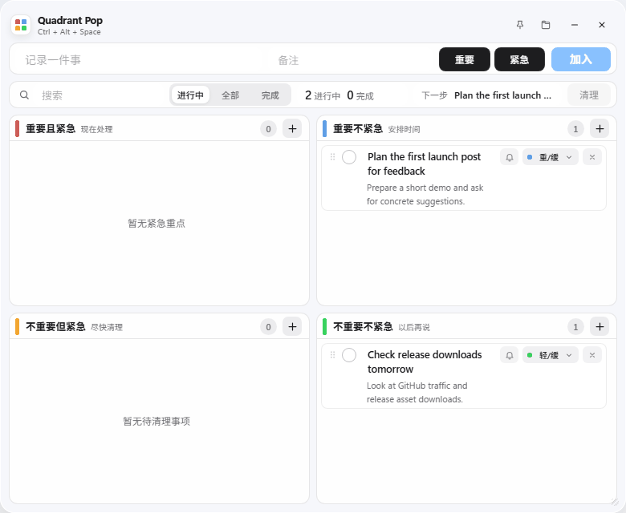
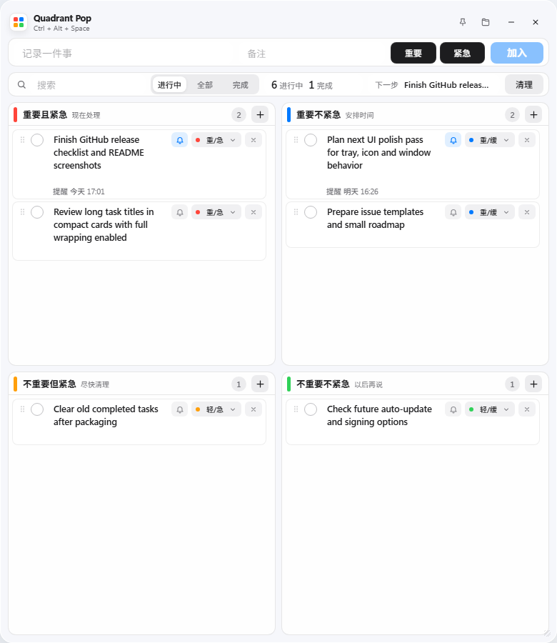
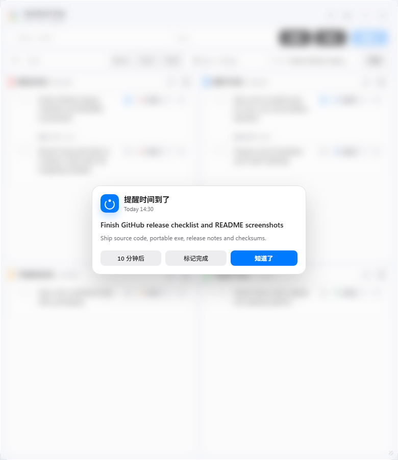

# Quadrant Pop Todo

一个 Windows 桌面待办小应用。按下快捷键后，它会在鼠标所在位置弹出，用四象限方式快速记录、整理和提醒待办事项。



## 界面预览



## 功能亮点

- **快捷键唤起**：默认 `Ctrl + Alt + Space`，被占用时自动尝试 `Ctrl + Shift + Space`。
- **鼠标位置弹出**：窗口会贴近当前鼠标位置，并自动保持在屏幕范围内。
- **四象限待办**：按“重要/紧急”整理为四个象限，适合临时记录和快速决策。
- **完整显示文字**：待办标题支持自动换行，不会因为过长而截断。
- **定时提醒**：每条待办都可以设置提醒时间，到点自动弹窗提醒。
- **拖动排序**：在同一个象限内拖动待办，可以调整优先级顺序。
- **本地优先**：数据保存在本机 JSON 文件中，不需要账号，不会上传到云端。
- **托盘常驻**：支持托盘图标、固定窗口、失焦隐藏、窗口大小拖拽和尺寸记忆。



## 下载使用

到 [Releases](https://github.com/729149195/quadrant-pop-todo/releases/latest) 下载最新的 `QuadrantPopTodo-*.exe`，双击运行即可。

这是个人开发者应用，当前 exe 未做商业代码签名。Windows SmartScreen 可能会提示风险；如果你不放心，可以直接查看源码并自行构建。Release 页面同时提供 `SHA256SUMS.txt`，用于校验下载文件是否完整。

## 快捷操作

| 操作 | 说明 |
| --- | --- |
| `Ctrl + Alt + Space` | 在鼠标位置呼出窗口 |
| `Ctrl + Shift + Space` | 备用快捷键 |
| 托盘图标单击 | 呼出窗口 |
| 标题栏图钉 | 固定/取消固定窗口 |
| 右下角拖拽 | 调整窗口宽高 |

## 本地开发

需要先安装 [Node.js](https://nodejs.org/)。

```powershell
npm install
npm start
```

运行冒烟测试：

```powershell
npm run smoke
```

打包 Windows 便携版 exe：

```powershell
npm run dist
```

打包结果会生成在 `dist/` 目录。

## 隐私和安全

- 不需要注册账号，也没有登录流程。
- 应用自身不发起网络请求，不上传待办数据，不包含遥测统计。
- 待办数据保存在本机 Electron `userData` 目录中，主要文件是 `todos.json` 和 `window-state.json`。
- 应用内的文件夹按钮可以直接打开数据目录，便于备份或迁移。
- Windows 便携版 exe 未做商业代码签名，首次运行时可能出现 SmartScreen 提示。

## 反馈

遇到问题或有功能建议，可以到 [Issues](https://github.com/729149195/quadrant-pop-todo/issues) 反馈。发布和推广材料放在 [`docs/launch`](docs/launch)。

## License

[MIT](LICENSE)
